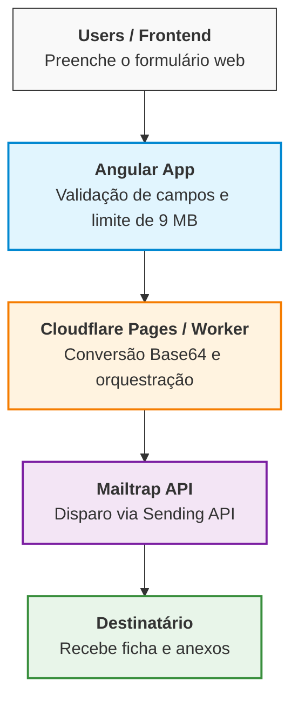

# Inscrição Catequese - Paróquia Nossa Senhora de Fátima

  

### Aplicação para gestão e envio de inscrições para a Catequese de Iniciação à Vida Cristã.

Sistema Web composto por um formulário reativo em Angular usando JavaScript/TypeScript para disparo de e-mails formatados com anexos via API do Mailtrap.

---

## Recursos usados no desenvolvimento:

- [Angular](https://angular.dev/);
- [TypeScript](https://www.typescriptlang.org/);
- [Bootstrap](https://getbootstrap.com/);
- [Mailtrap API](https://mailtrap.io/);
- [Git](https://git-scm.com);
- [Visual Studio Code](https://code.visualstudio.com/);
- [Cloudflare Pages](https://pages.cloudflare.com/);

---

## Pré-requisitos:

Antes de rodar o projeto localmente ou em servidor, certifique-se de ter instalado:

- [Node.js](https://nodejs.org/) (v18 ou superior);
- [Angular CLI](https://angular.dev/cli);

---

## 🏗️ Arquitetura do Sistema (Full Stack Architecture)


---

## Obtendo uma cópia e executando localmente:

```shell
# Clone o repositório
$ git clone https://github.com/douglascarlos-dev/paroquianossasenhoradefatima.git

# Acesse a pasta do projeto
$ cd paroquianossasenhoradefatima

# Instale as dependências
$ npm install

# Execute o servidor de desenvolvimento do Angular
$ ng serve
```

## Configurar as Variáveis de Ambiente no Cloudflare

```shell
#Environment Variables
MAILTRAP_API_TOKEN
MAILTRAP_SENDER_EMAIL
MAILTRAP_RECIPIENT_EMAIL
```
